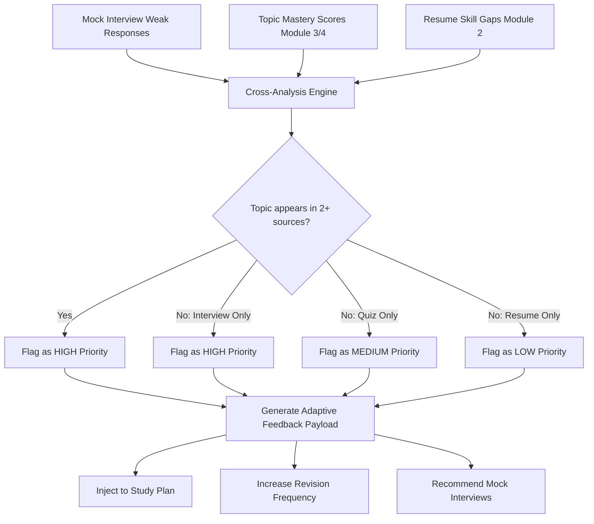

# Module 7: Unified Career Intelligence & Optimization Engine

## 1. Module Overview & Purpose
The Unified Career Intelligence & Optimization Engine serves as the core analytical framework of the AI Career Intelligence Engine (ACIE). Its purpose is to aggregate raw, disparate performance vectors from multiple modules—specifically auth, resume intelligence, quiz assessment engines, and simulated mock interviews—into actionable, high-fidelity metrics. 

By calculating multi-dimensional readiness metrics and running a real-time cross-analysis check, the engine uncovers individual performance anomalies, identifies skills and concept gaps, and initiates targeted study plans and mocks to accelerate student preparation.

---

## 2. API Documentation

### Compute Scores
- **Endpoint**: `POST /api/career-intelligence/compute`
- **Authentication**: Required (`protect`)
- **Description**: Computes current IRS, CCI, and CRS scores based on the latest interview/evaluation outcomes, triggers the cross-analysis loop, and logs a new chronological entry in the `ScoreHistory` collection.
- **Request Body**:
  ```json
  {
    "technicalScore": 85,
    "behavioralScore": 75,
    "roleSkillMatch": 80,
    "weakInterviewTopics": ["React Hooks", "Redux Toolkit"],
    "grammarAccuracy": 90,
    "logicalSequencing": 80,
    "conceptArticulation": 85,
    "redundancyLevel": 15,
    "starMethodCompliance": 80,
    "roleAlignment": 85
  }
  ```
- **Response Format**:
  ```json
  {
    "success": true,
    "message": "Career intelligence scores computed and saved successfully",
    "data": {
      "scoreRecord": {
        "id": "603d2e1c9b1d92305a415a77",
        "timestamp": "2026-07-11T02:10:00.000Z"
      },
      "scores": {
        "IRS": 81,
        "irsClassification": "Moderately Ready",
        "CCI": 85,
        "cciClassification": "Excellent",
        "CRS": 80,
        "crsClassification": "On Track"
      },
      "breakdowns": {
        "irs": {
          "resumeStrength": 80,
          "technicalPerformance": 85,
          "behavioralPerformance": 75,
          "roleSkillMatch": 80
        },
        "cci": {
          "grammarAccuracy": 90,
          "logicalSequencing": 80,
          "conceptArticulation": 85,
          "redundancyLevel": 15,
          "redundancyContribution": 85,
          "starMethodCompliance": 80
        },
        "crs": {
          "learningMastery": 75,
          "interviewReadiness": 81,
          "consistencyScore": 60,
          "roleAlignment": 85
        }
      },
      "crossAnalysis": {
        "weaknesses": [],
        "flaggedTopics": [
          {
            "topicName": "React Hooks",
            "priority": "High",
            "reason": "Weak interview response detected for this topic. Targeted practice recommended."
          }
        ],
        "adaptiveFeedbackTriggered": true
      }
    }
  }
  ```

### Growth Trend API
- **Endpoint**: `GET /api/career-intelligence/growth-trend`
- **Authentication**: Required (`protect`)
- **Query Parameters**:
  - `limit` (Optional, Default: `20`): Maximum history records to return.
- **Description**: Returns chronological entries of scores for the authenticated user for trend chart rendering.
- **Response Format**:
  ```json
  {
    "success": true,
    "message": "Growth trend data retrieved successfully",
    "data": {
      "trend": [
        {
          "timestamp": "2026-07-10T12:00:00.000Z",
          "IRS": 70,
          "CCI": 68,
          "CRS": 65,
          "irsClassification": "Moderately Ready",
          "cciClassification": "Good",
          "crsClassification": "Progressing"
        },
        {
          "timestamp": "2026-07-11T02:10:00.000Z",
          "IRS": 81,
          "CCI": 85,
          "CRS": 80,
          "irsClassification": "Moderately Ready",
          "cciClassification": "Excellent",
          "crsClassification": "On Track"
        }
      ],
      "meta": {
        "totalRecords": 2,
        "improvementPercentage": 23
      }
    }
  }
  ```

### Career Readiness Summary API
- **Endpoint**: `GET /api/career-intelligence/summary`
- **Authentication**: Required (`protect`)
- **Description**: Retrieves the most recent scores, classification labels, list of currently flagged topics, and detected weaknesses.
- **Response Format**:
  ```json
  {
    "success": true,
    "message": "Career readiness summary retrieved successfully",
    "data": {
      "hasData": true,
      "scores": {
        "IRS": 81,
        "irsClassification": "Moderately Ready",
        "CCI": 85,
        "cciClassification": "Excellent",
        "CRS": 80,
        "crsClassification": "On Track",
        "lastUpdated": "2026-07-11T02:10:00.000Z"
      },
      "flaggedTopics": [
        {
          "topicName": "React Hooks",
          "priority": "High",
          "reason": "Weak interview response detected for this topic. Targeted practice recommended."
        }
      ],
      "weaknesses": [],
      "adaptiveFeedbackTriggered": true
    }
  }
  ```

---

## 3. Mathematical Formulas & Classifications

### Interview Readiness Score (IRS)
Measures simulated interview performance, technical credentials, and profile relevance.
$$IRS = (\text{Resume Strength} \times 0.20) + (\text{Technical Performance} \times 0.40) + (\text{Behavioral Performance} \times 0.20) + (\text{Role Skill Match} \times 0.20)$$

| Score Range | Classification | Action/Status |
|---|---|---|
| **85 – 100** | Highly Ready | Direct entry to cohort placement drives |
| **70 – 84** | Moderately Ready | Needs minor mock interview polish |
| **50 – 69** | Developing | Mandatory mock interviews scheduled |
| **Below 50** | Needs Significant Improvement | Locked from mock sessions, core assignment focus |

### Communication Clarity Index (CCI)
Assesses verbal response metrics, structural layout, grammar correctness, and brevity.
$$CCI = (\text{Grammar Accuracy} \times 0.25) + (\text{Logical Sequencing} \times 0.25) + (\text{Concept Articulation} \times 0.20) + ((100 - \text{Redundancy Level}) \times 0.15) + (\text{STAR Compliance} \times 0.15)$$

| Score Range | Classification |
|---|---|
| **80 – 100** | Excellent |
| **60 – 79** | Good |
| **40 – 59** | Fair |
| **Below 40** | Needs Improvement |

### Career Readiness Score (CRS)
The overarching score assessing a student's holistic readiness for hiring pipelines.
$$CRS = (\text{Learning Mastery} \times 0.30) + (\text{Interview Readiness} \times 0.40) + (\text{Consistency Score} \times 0.10) + (\text{Role Alignment} \times 0.20)$$
*The Consistency Score is dynamically generated as $min(100, \text{Attempt Count} \times 12)$.*

| Score Range | Classification |
|---|---|
| **85 – 100** | Career Ready |
| **70 – 84** | On Track |
| **50 – 69** | Progressing |
| **Below 50** | Early Stage |

---

## 4. Cross-Analysis & Adaptive Feedback Loop

The system operates a multi-source cross-analysis pipeline when computing scores:



### Execution Steps:
1. **Source Collection**: Extracts data from `User.learningProfile.topicMastery`, `User.resumeData.missingSkills`, and the latest simulated interview's weak topics.
2. **Prioritization Check**:
   - Overlap in 2 or more sources $\to$ **High Priority**.
   - Interview performance failure $\to$ **High Priority**.
   - Quiz/assignment mastery gap $\to$ **Medium Priority**.
   - Resume skill absence $\to$ **Low Priority**.
3. **Trigger**:
   - High-priority topics trigger study plan injections ($3 \times \text{sessions/week}$) and schedule target mock interview warnings.
   - Medium-priority topics increase active revision frequency ($2 \times \text{sessions/week}$).

---

## 5. ScoreHistory Schema Documentation

```javascript
{
  userId: ObjectId,                // Ref: User, Indexed
  resumeStrength: Number,          // 0-100
  technicalScore: Number,          // 0-100
  behavioralScore: Number,         // 0-100
  roleSkillMatch: Number,          // 0-100
  IRS: Number,                     // 0-100
  irsClassification: String,
  grammarAccuracy: Number,         // 0-100
  logicalSequencing: Number,       // 0-100
  conceptArticulation: Number,     // 0-100
  redundancyScore: Number,         // 0-100
  starMethodCompliance: Number,    // 0-100
  CCI: Number,                     // 0-100
  cciClassification: String,
  learningMastery: Number,         // 0-100
  consistencyScore: Number,        // 0-100
  roleAlignment: Number,           // 0-100
  CRS: Number,                     // 0-100
  crsClassification: String,
  flaggedTopics: [{
    topicName: String,
    priority: String,              // High, Medium, Low
    reason: String
  }],
  weaknesses: [{
    area: String,
    source: String,
    details: String
  }],
  adaptiveFeedbackTriggered: Boolean,
  createdAt: Date,
  updatedAt: Date
}
```

---

## 6. Integration Architecture
- **Module 1 (Auth)**: Fetches credentials, checks roles, verifies `isActive` account statuses.
- **Module 2 (Resume Intelligence)**: Integrates `User.resumeData.strengthScore` to feed the IRS formula, and lists `missingSkills` as input for cross-analysis.
- **Module 3 (Quiz Engine) & Module 4 (Assignment Engine)**: Populates `User.learningProfile.overallMasteryScore` for the CRS formula and uses topic-wise mastery metrics to detect performance weaknesses.
- **Module 6 (Mock Interview Engine)**: Supplies `technicalScore`, `behavioralScore`, and weak topics detected during conversational voice simulation.
