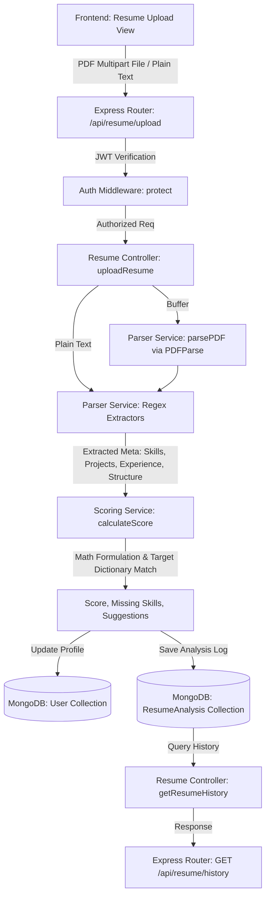

# Resume Intelligence Module API Documentation

This document provides a comprehensive overview, architectural design, core evaluation logic, and API specification for the **Resume Intelligence Module** of the AI Career Intelligence Engine (ACIE).

---

## 1. Overview

The **Resume Intelligence Module** is a core engine within the ACIE platform designed to parse, evaluate, and provide analytical scoring for developer resumes. Its primary objectives are:
- **Text Extraction**: Parse uploaded PDF files or handle direct plain text resume submittals.
- **Skill Alignment Mapping**: Align the extracted skills against standardized target role requirements (e.g., Full-Stack Developer, Data Scientist, DevOps Engineer, etc.) to detect missing competencies.
- **Quantitative Scoring**: Calculate a weighted metric score between 0 and 100 representing resume strength.
- **Structured Recommendations**: Provide action-oriented suggestions for improving the resume's skills profile, project depth, and formatting.

---

## 2. Architectural Flow

The data flow spans from the client-side drag-and-drop/input interfaces to text extraction services, the scoring calculator, and finally into the MongoDB storage models.



---

## 3. Core Evaluation Logic

The scoring engine evaluates resumes out of a maximum of 100 points based on four key structural and qualitative metrics.

### Mathematical Formulation
The overall **Resume Strength Score** is computed using the following weighted linear combination:

$$\text{Resume Strength} = (\text{Skill Relevance} \times 0.40) + (\text{Project Depth} \times 0.30) + (\text{Experience Indicators} \times 0.20) + (\text{Structure Score} \times 0.10)$$

*The final score is rounded to the nearest integer.*

### Evaluation Metrics Breakdown

| Metric | Weight | Target Max | Description |
| :--- | :--- | :--- | :--- |
| **Skill Relevance** | 40% | 100 pts | Calculates the percentage of matching skills compared against the requirements of the selected `targetRole`. |
| **Project Depth** | 30% | 100 pts | Evaluates hand-on experience based on the quantity and complexity of projects listed (25 pts per project, capped at 4 projects). |
| **Experience Indicators**| 20% | 100 pts | Measures domain experience in years, extracted via date ranges (20 pts per year, capped at 5 years). |
| **Structure Score** | 10% | 100 pts | Evaluates the layout compliance. Checks for presence of 5 core sections (20 pts each for: Contact Info, Education, Experience, Projects, Skills). |

---

## 4. API Endpoints Specification

All routes described below must be authenticated via JSON Web Tokens.

### 4.1 Upload and Analyze Resume

Processes multipart form data (PDF uploads) or raw text payloads, performs scoring, updates the user's latest profile metadata, and saves a history log.

- **HTTP Method**: `POST`
- **Route Path**: `/api/resume/upload`
- **Headers**:
  - `Authorization`: `Bearer <JWT_TOKEN>` (Required)
  - `Content-Type`: `multipart/form-data` OR `application/json`

#### Request Payload Structure

- **Scenario A: PDF File Upload (Multipart Form)**
  - File key: `resume` (Binary PDF file)
  - Text field: `targetRole` (String, Optional. E.g., `"Full-Stack Developer"`)

- **Scenario B: Plain Text Payload (JSON)**
  ```json
  {
    "resumeText": "Jane Doe\njane@example.com\nSkills: React, Node.js, Express, MongoDB\nProjects: Chat Application...",
    "targetRole": "Full-Stack Developer"
  }
  ```

#### Response Payloads

##### Success Response (`201 Created`)
```json
{
  "success": true,
  "message": "Resume analyzed successfully",
  "data": {
    "fileName": "resume.pdf",
    "targetRole": "Full-Stack Developer",
    "strengthScore": 70,
    "scoreBreakdown": {
      "skillRelevance": 83,
      "projectDepth": 50,
      "experienceIndicators": 60,
      "structureScore": 100
    },
    "extractedSkills": [
      "React",
      "Node.js",
      "Express",
      "MongoDB",
      "JavaScript",
      "Git",
      "Docker"
    ],
    "missingSkills": [
      "HTML",
      "CSS",
      "SQL",
      "TypeScript"
    ],
    "detectedProjects": [
      "E-commerce Platform",
      "Task Tracker API"
    ],
    "detectedExperienceYears": 3,
    "improvementSuggestions": [
      "Acquire and highlight these missing key skills for Full-Stack Developer: HTML, CSS, SQL, TypeScript.",
      "Add more detailed technical projects (aim for at least 3-4) describing your hands-on achievements."
    ],
    "analysisId": "6a514b7882379001b5be36ce"
  }
}
```

##### Error Response (`400 Bad Request` - Missing Parameters)
```json
{
  "success": false,
  "message": "Please upload a PDF resume or provide resume text in 'resumeText'"
}
```

##### Error Response (`401 Unauthorized` - Missing/Invalid Token)
```json
{
  "success": false,
  "message": "Invalid or expired access token."
}
```

---

### 4.2 Fetch Resume Analysis History

Retrieves a list of all historical resume analyses run by the authenticated user, sorted in descending chronological order.

- **HTTP Method**: `GET`
- **Route Path**: `/api/resume/history`
- **Headers**:
  - `Authorization`: `Bearer <JWT_TOKEN>` (Required)

#### Response Payloads

##### Success Response (`200 OK`)
```json
{
  "success": true,
  "count": 1,
  "data": [
    {
      "_id": "6a514b7882379001b5be36ce",
      "user": "6a514b7782379001b5be36cd",
      "fileName": "resume.pdf",
      "targetRole": "Full-Stack Developer",
      "strengthScore": 70,
      "scoreBreakdown": {
        "skillRelevance": 83,
        "projectDepth": 50,
        "experienceIndicators": 60,
        "structureScore": 100
      },
      "extractedSkills": [
        "React",
        "Node.js",
        "Express",
        "MongoDB",
        "JavaScript",
        "Git",
        "Docker"
      ],
      "missingSkills": [
        "HTML",
        "CSS",
        "SQL",
        "TypeScript"
      ],
      "detectedProjects": [
        "E-commerce Platform",
        "Task Tracker API"
      ],
      "detectedExperienceYears": 3,
      "improvementSuggestions": [
        "Acquire and highlight these missing key skills for Full-Stack Developer: HTML, CSS, SQL, TypeScript.",
        "Add more detailed technical projects (aim for at least 3-4) describing your hands-on achievements."
      ],
      "createdAt": "2026-07-10T19:43:52.100Z",
      "updatedAt": "2026-07-10T19:43:52.100Z",
      "__v": 0
    }
  ]
}
```

##### Error Response (`501 Internal Server Error` - Database Exception)
```json
{
  "success": false,
  "message": "An error occurred while fetching resume history"
}
```
